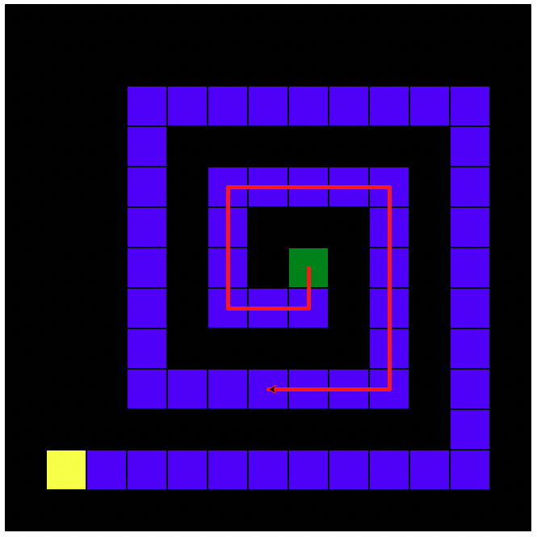

# Turbozzle

This project is an "extension" of the [RoboZZle](http://www.robozzle.com)
website. It is intended to help students who are learning python (and enjoyed
playing RoboZZle) expand on their knowledge of functions, loops, and recursion.
In addition, the lesson is designed to help students who are working with
`vscode` for the first time start to understand why it can be such a powerful
(and confusing) editor.

## Instructions

The code is paired with a [PRIMM-based worksheet](https://docs.google.com/document/d/1fekLawCFuocIC7UNs41wR1hAvdX_QMzMMIOz599dnUU)
that guides students through the problems and asks questions intending to make
them think more deeply about how the puzzles pertain to concepts they've
learned.

> Note: The version of the code to be used by students is on the `for_students` branch.

## Citations

- Robozzle: a great logic game where you can build you own programming puzzles
    - http://www.robozzle.com
- Inspiration for doing a Python version of Robozzle for learning purposes
    - https://www.pythonclassroom.com/turtle-graphics/turtle-maze
